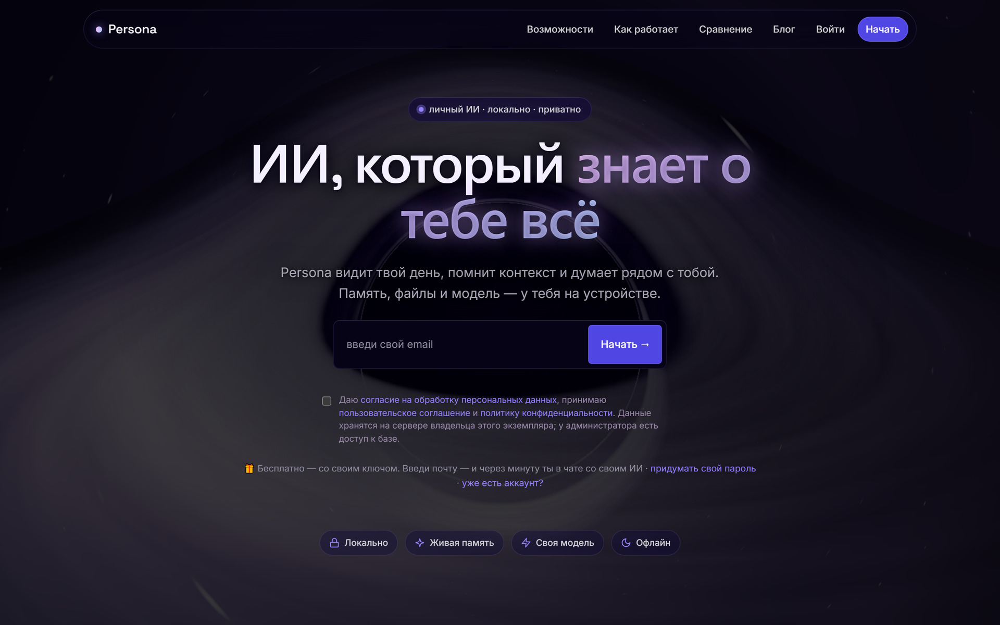
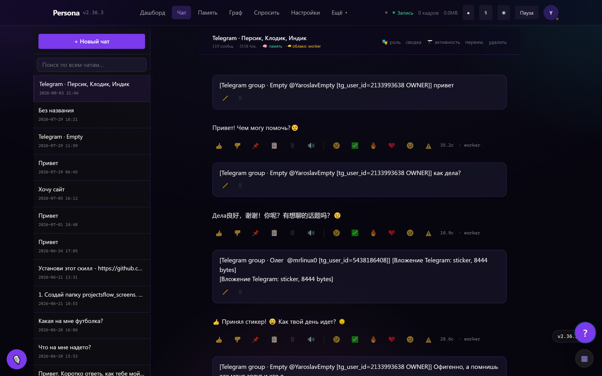
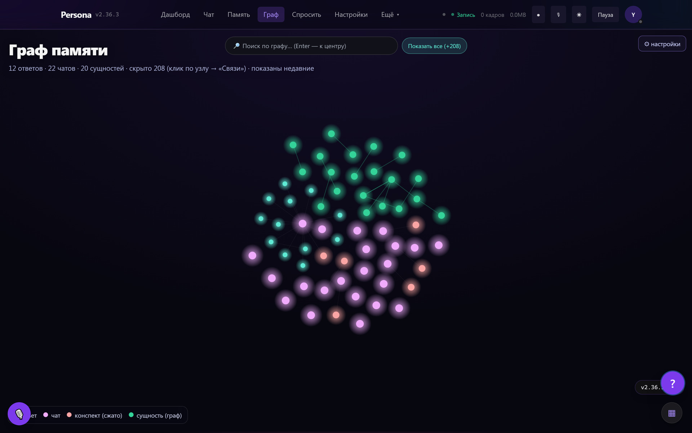
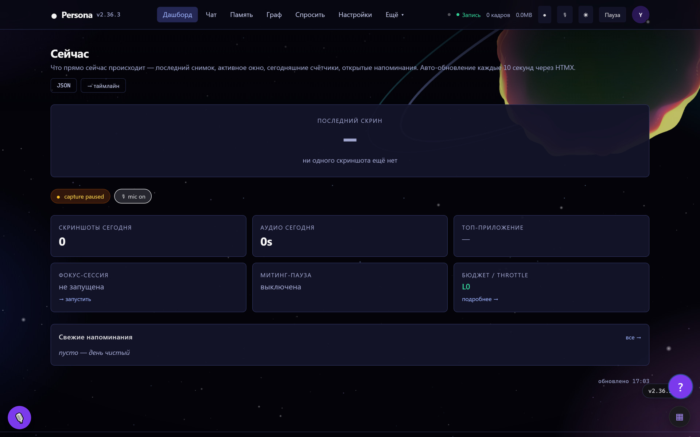
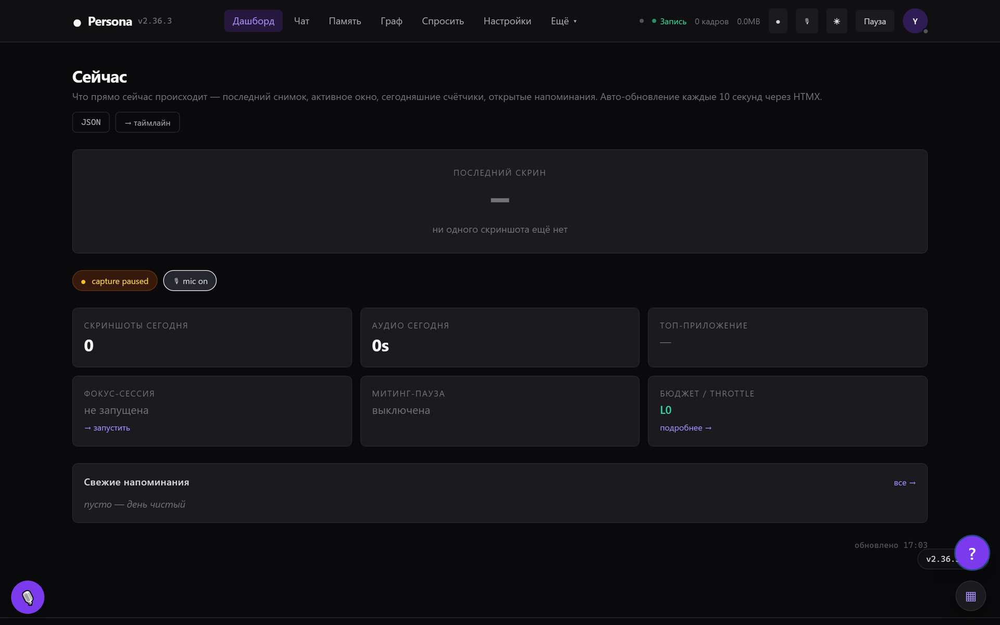
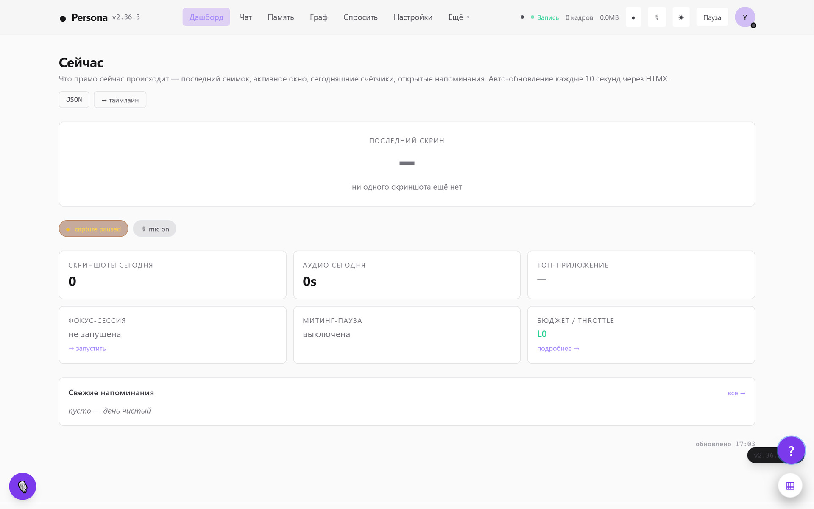
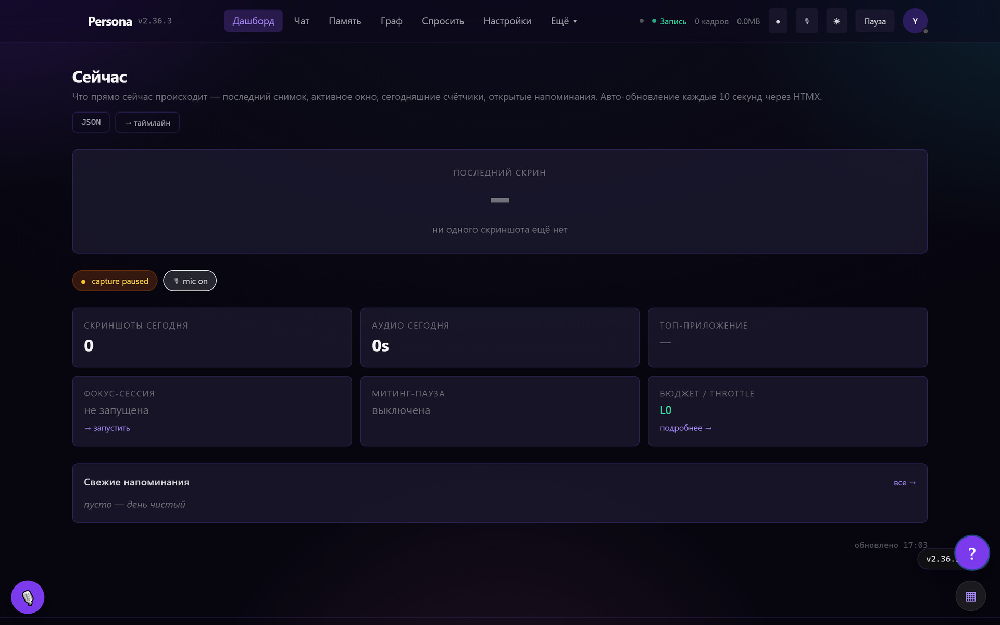
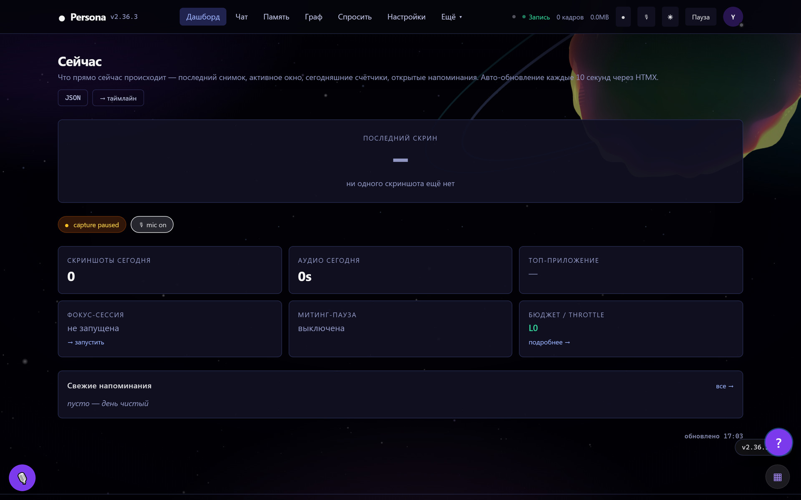

<div align="center">

# ● Persona

**Личный ИИ-ассистент с долгой памятью. На твоём железе. С твоей моделью.**

*A self-hosted personal AI assistant with long-term memory. Your hardware, your model, your data.*

[](LICENSE)
[](https://www.python.org/)
[](https://fastapi.tiangolo.com/)
[](https://www.sqlite.org/)
[](https://ollama.com/)
[](https://persona.getdoday.ru)

[🇷🇺 Русский](#-persona--личный-ии-с-памятью) · [🇬🇧 English](#-persona--a-personal-ai-that-remembers) · [🌐 persona.getdoday.ru](https://persona.getdoday.ru)



</div>

---

# 🇷🇺 Persona — личный ИИ с памятью

Обычные ассистенты забывают тебя после каждой вкладки. Persona — нет.

Это **самостоятельно разворачиваемый ИИ-ассистент**, который помнит твои разговоры,
строит из них граф связей и работает **на твоей модели** — облачный ключ или локальная
Ollama. Данные лежат в SQLite у тебя, а не в чужом облаке.

> 🎯 **Коротко:** приватный ИИ-помощник, который знает твой контекст. Без подписки,
> без обязательного облака, с открытым кодом.

**Попробовать без установки:** [persona.getdoday.ru](https://persona.getdoday.ru) —
регистрация открыта и бесплатна, приходишь со своим ключом к модели.

## ✨ Что умеет

| | |
|---|---|
| 💬 **Чат с памятью** | Перед ответом ассистент подтягивает релевантное из всех прошлых бесед: FTS5 с ранжированием bm25, опционально — гибридный поиск с векторами. Отдельным блоком подмешиваются личные факты о тебе. |
| 🕸 **Граф памяти** | Промпты, ответы, сущности и связи между ними. Живая force-directed раскладка, а не картинка. |
| 🎥 **Захват дня** | Скриншоты рабочего экрана с дедупликацией по перцептивному хэшу, OCR, распознавание активного окна, аудио. С квотами, тихими часами и блоклистом приложений. |
| 🗞 **Сводки и брифинг** | Часовые карточки, дневные пины, недельные сводки, проактивные карточки «что было важного». |
| 🎙 **Голос** | Разговор hands-free: орб-микрофон, VAD, синтез речи. |
| 🧩 **Навыки и автоматизация** | Наборы инструкций из GitHub (`SKILL.md`), браузер-агент, MCP-рантайм со встроенными инструментами. |
| 🔒 **Vault** | Зашифрованные заметки. Секреты участников шифруются в покое. |
| 👥 **Мультипользовательский режим** | Регистрация открыта, каждый приходит со своим ключом. Данные захвата — только у владельца инстанса, участник видит строго своё. |
| 🎨 **Пять тем** | `dark`, `light`, `persona`, `cosmos` и `cosmos-dark` — последние две с живой 3D-сценой за кабинетом. |
| 📊 **И ещё** | Блог-движок, аналитика, аудит-лог, резервные копии, Telegram-бот, интеграция с Алисой, экспорт напоминаний в `.ics`. |

## 🖼 Как это выглядит

<table>
<tr>
<td width="50%"><br><sub><b>Чат с памятью</b></sub></td>
<td width="50%"><br><sub><b>Граф памяти</b></sub></td>
</tr>
<tr>
<td><br><sub><b>Дашборд «Сейчас»</b></sub></td>
<td><br><sub><b>Тема cosmos</b></sub></td>
</tr>
</table>

<details>
<summary>🎨 Ещё темы — dark, light, persona, cosmos-dark</summary>
<br>
<table>
<tr>
<td width="50%"><br><sub><code>dark</code></sub></td>
<td width="50%"><br><sub><code>light</code></sub></td>
</tr>
<tr>
<td><br><sub><code>persona</code></sub></td>
<td><br><sub><code>cosmos-dark</code></sub></td>
</tr>
</table>
</details>

## 🚀 Быстрый старт

```bash
git clone https://github.com/SwairIt/persona.git
cd persona

python -m venv .venv
.venv\Scripts\activate          # Windows
# source .venv/bin/activate     # macOS / Linux

pip install -e .
cp .env.example .env            # заполнять не обязательно: всё настраивается через UI

python -m uvicorn app.web.main:create_app --factory --host 127.0.0.1 --port 8000
```

Открываешь <http://127.0.0.1:8000>, регистрируешься — **первый зарегистрировавшийся
становится владельцем инстанса**. Дальше в `/settings/llm` подключаешь модель:
ключ к облачному провайдеру или локальную Ollama.

<details>
<summary>🐳 Через Docker</summary>

```bash
docker compose up -d
# → http://localhost:8000
```

Данные складываются в том, примонтированный к `~/.persona`. Захват экрана в контейнере
недоступен — для него нужен агент на самой машине (`/welcome/install/mac`,
`/welcome/install/windows`).
</details>

<details>
<summary>⚙️ Что нужно для отдельных функций</summary>

| Функция | Что поставить |
|---|---|
| Чат, память, граф | ничего сверх базовой установки + ключ к модели |
| Локальная модель | [Ollama](https://ollama.com/) + `ollama pull qwen2.5:3b` |
| Векторный поиск | `pip install sqlite-vec` + embed-модель (`nomic-embed-text`) |
| OCR по скриншотам | [Tesseract](https://github.com/tesseract-ocr/tesseract) и `PERSONA_TESSERACT_PATH` |
| Голос | микрофон в браузере (нужен HTTPS или `localhost`) |

Без них приложение работает — просто соответствующая функция тихо выключена.
</details>

## 🔐 Приватность — как оно устроено на самом деле

Это не маркетинговый абзац, а описание модели доверия. Читай его до того, как заводить аккаунт.

- **Всё лежит у тебя.** База — SQLite в `~/.persona/`, вне репозитория. Скриншоты,
  аудио, память, вложения — там же. Никакой телеметрии в наш адрес нет.
- **Модель — твоя.** Каждый не-владелец резолвит провайдера и ключ **только из своих**
  настроек. Провайдер «ПК владельца» участнику запрещён на уровне кода.
- **Владелец инстанса видит базу.** Если ты регистрируешься на чужом инстансе — у его
  администратора есть доступ к файлу БД. Секреты, сообщения и память участников
  шифруются в покое, но честно: физический доступ к машине сильнее любого шифрования.
  Хочешь полной приватности — подними свой инстанс, это и есть смысл проекта.
- **Границы ролей проверяются тестами.** Данные захвата, таймлайн, дашборды —
  только владелец. Участник видит строго своё; на это есть отдельный набор тестов
  (`tests/test_member_settings_isolation.py`, `tests/test_owner_exclusive_lockdown.py`).
- **Секреты не попадают в git.** Pre-commit хук + тест гоняют один набор правил
  (`ops/secret_scan.py`, `docs/SECRET_HYGIENE.md`). Вся история репозитория
  просканирована перед публикацией — реальных ключей в ней нет.

## 🏗 Стек и архитектура

**FastAPI** · **SQLite** (WAL, 235 миграций) · **Jinja2** · **htmx** · **Alpine.js** ·
**Tailwind** (собран заранее, не Play-CDN) · **structlog**

Серверный рендеринг, никакого React и никакой сборки фронтенда. Интерактив — htmx
плюс островки Alpine. Так один человек может держать 429 модулей роутов и 383 шаблона
и не утонуть.

```
app/
├── web/          роуты, шаблоны, статика, middleware
├── chat/         сессии, память, промпты
├── llm/          клиенты провайдеров, инструменты
├── auth/         пользователи, сессии, роли, шифрование
├── storage/      SQLite, миграции, репозитории
├── capture/      скриншоты, дедуп, OCR, аудио
└── telegram/     бот и разбор сообщений
```

Подробнее — в [`docs/`](docs/): [архитектурный план](docs/ARCHITECTURE_MASTER_PLAN.md), [гигиена секретов](docs/SECRET_HYGIENE.md),
[шифрование данных участников](docs/MEMBER_ENCRYPTION.md), [всегда-включённый режим на Windows](docs/ALWAYS_ON_WINDOWS.md).

**Цифры на момент публикации:** ~75 000 строк Python, 429 модулей роутов,
383 шаблона, 235 миграций, 182 файла тестов, 583 коммита.

## 🤝 Как помочь

Issues и pull request'ы приветствуются. Перед PR:

```bash
sh ops/install_hooks.sh                    # один раз на клон — хук против секретов
.venv/Scripts/python.exe -m pytest tests/  # полный прогон идёт долго, это норма
```

Если добавляешь Tailwind-класс — **пересобери CSS** (`ops/tailwind/README.md`),
иначе он молча не применится. Тест `test_tailwind_build_is_current.py` это ловит.

## 👤 Автор

**Ярослав Боев** — в сети **SwairIt**. Мне 15, учусь в школе в Подмосковье.

До Persona сделал [**Doday**](https://getdoday.ru) — бесплатный таск-менеджер с
веб-версией, Telegram Mini App и ботом.

Пишу в паре с [Claude Code](https://claude.com/claude-code) и не делаю из этого секрета.
Решения, архитектура и разбор граблей — мои; ИИ здесь клавиатура, а не голова.

- 🌐 Сайт проекта: [persona.getdoday.ru](https://persona.getdoday.ru)
- 💬 Telegram: [@SwairIt](https://t.me/SwairIt)
- 📦 Другой проект: [getdoday.ru](https://getdoday.ru)

## 📄 Лицензия

[AGPL-3.0](LICENSE). Коротко: делай что хочешь, но если поднимаешь Persona как сервис
для других — открывай свои изменения. Код остаётся общим.

---

# 🇬🇧 Persona — a personal AI that remembers

Most assistants forget you the moment you close the tab. Persona doesn't.

It is a **self-hosted personal AI assistant** that remembers your conversations, builds
a graph of what connects them, and runs **on your own model** — a cloud API key or a
local Ollama. Your data lives in a SQLite file you own, not in someone else's cloud.

> 🎯 **In short:** a privacy-first AI assistant that actually knows your context.
> No subscription, no mandatory cloud, open source.

**Try it without installing:** [persona.getdoday.ru](https://persona.getdoday.ru) —
registration is free and open; you bring your own model key.

## ✨ Features

| | |
|---|---|
| 💬 **Chat with memory** | Before answering, the assistant pulls what's relevant from every past conversation — SQLite FTS5 with bm25 ranking, optionally a hybrid vector search. Personal facts about you are mixed in as a separate block. |
| 🕸 **Memory graph** | Prompts, answers, entities and the links between them, in a live force-directed layout. |
| 🎥 **Screen capture** | Screenshots with perceptual-hash dedup, OCR, active-window detection, audio. With quotas, quiet hours and an application blocklist. |
| 🗞 **Digests & briefing** | Hourly cards, daily pins, weekly summaries, proactive "here's what mattered" cards. |
| 🎙 **Voice** | Hands-free conversation: mic orb, VAD, text-to-speech. |
| 🧩 **Skills & automation** | Instruction packs pulled from GitHub (`SKILL.md`), a browser agent, an MCP runtime with built-in tools. |
| 🔒 **Vault** | Encrypted notes. Member secrets are encrypted at rest. |
| 👥 **Multi-user** | Open registration, everyone brings their own key. Capture data stays with the instance owner; a member only ever sees their own. |
| 🎨 **Five themes** | `dark`, `light`, `persona`, `cosmos` and `cosmos-dark` — the last two with a live 3D scene behind the app. |
| 📊 **And more** | Blog engine, analytics, audit log, backups, Telegram bot, Yandex Alice integration, `.ics` reminder export. |

## 🚀 Quick start

```bash
git clone https://github.com/SwairIt/persona.git
cd persona

python -m venv .venv
source .venv/bin/activate       # macOS / Linux
# .venv\Scripts\activate        # Windows

pip install -e .
cp .env.example .env            # optional — everything is configurable from the UI

python -m uvicorn app.web.main:create_app --factory --host 127.0.0.1 --port 8000
```

Open <http://127.0.0.1:8000> and sign up — **the first account to register becomes the
instance owner.** Then connect a model in `/settings/llm`: a cloud provider key or a
local Ollama endpoint.

Docker: `docker compose up -d`. Screen capture is not available inside a container —
it needs the agent installed on the machine itself.

## 🔐 Privacy — the actual trust model

Not a marketing paragraph. Read it before creating an account anywhere.

- **Everything stays with you.** The database is SQLite under `~/.persona/`, outside the
  repository. Screenshots, audio, memory and attachments live there too. No telemetry
  is sent to us.
- **The model is yours.** Every non-owner user resolves their provider and key **only
  from their own** settings. The "owner's machine" provider is forbidden to members at
  the code level.
- **The instance owner can read the database.** If you register on someone else's
  instance, their admin has access to the DB file. Member secrets, messages and memory
  are encrypted at rest, but let's be honest: physical access beats any encryption.
  If you want real privacy, run your own instance — that's the whole point.
- **Role boundaries are enforced by tests.** Capture data, timeline and dashboards are
  owner-only; a member sees strictly their own. There is a dedicated test suite for it.
- **Secrets never reach git.** A pre-commit hook and a pytest run share one rule set
  (`ops/secret_scan.py`). The full repository history was scanned before going public —
  no real credentials in it.

## 🏗 Stack

**FastAPI** · **SQLite** (WAL, 235 migrations) · **Jinja2** · **htmx** · **Alpine.js** ·
**Tailwind** (precompiled, not the Play CDN) · **structlog**

Server-side rendering, no React, no frontend build step. Interactivity is htmx plus small
islands of Alpine. That's how one person keeps 429 route modules and 383 templates afloat.

**By the numbers:** ~75,000 lines of Python, 429 route modules, 383 templates,
235 migrations, 182 test files, 583 commits.

## 👤 Author

**Yaroslav Boev** — **SwairIt** online. I'm 15, still in school, near Moscow.

Before Persona I built [**Doday**](https://getdoday.ru), a free task manager with a web
app, a Telegram Mini App and a bot.

I write with [Claude Code](https://claude.com/claude-code) and don't hide it. The
decisions, the architecture and the debugging are mine; the AI is a keyboard, not a head.

- 🌐 Project: [persona.getdoday.ru](https://persona.getdoday.ru)
- 💬 Telegram: [@SwairIt](https://t.me/SwairIt)

## 📄 License

[AGPL-3.0](LICENSE). Short version: do what you like, but if you run Persona as a service
for other people, publish your changes. The code stays common property.

---

<div align="center">

<sub>

**Keywords / ключевые слова:** personal AI assistant · self-hosted AI · AI with long-term memory ·
local-first AI · privacy-first assistant · bring your own model · Ollama · open source ChatGPT
alternative · personal knowledge base · memory graph · FastAPI · SQLite · htmx ·
личный ИИ-ассистент · ИИ с памятью · приватный ИИ · локальный ИИ · свой ИИ на сервере ·
ассистент с памятью · self-hosted ассистент · альтернатива ChatGPT

</sub>

Сделано [Ярославом Боевым](https://t.me/SwairIt) · Made by [Yaroslav Boev](https://t.me/SwairIt)

</div>
